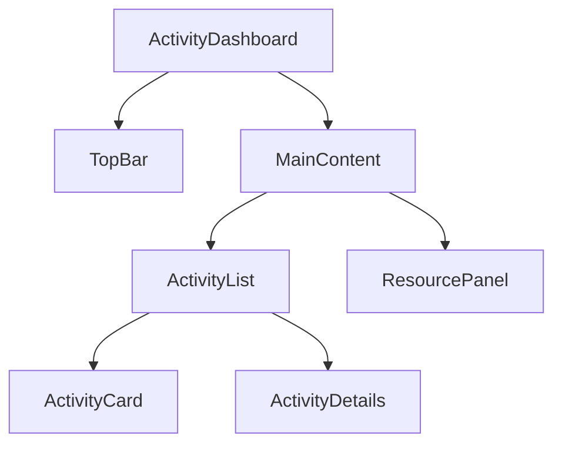

# Feature Task 001 Completion Report

## 🎯 Task Details
- **Task ID**: feature_task_001
- **Title**: Farm Activity UI Planning Document
- **Status**: ✅ Completed
- **Branch**: dev/feature_task_001
- **Reviewer**: Pending Mc Oforha approval

## 📁 Files Modified/Created
1. `/d/SIte/farm-management/bin/farm-activity-ui-plan.md` (Created)
   - Complete UI planning document
   - Component specifications
   - Data flow diagrams
   - Design system guidelines

## 🔍 Implementation Details

### Component Structure
```typescript
// Key interfaces defined
interface ActivityDashboardProps {...}
interface ActivityRecord {...}
interface Resource {...}
```

### File Tree (To Be Implemented)
```
src/components/FarmActivity/
├── Dashboard/
│   ├── ActivityDashboard.tsx
│   ├── TopBar/
│   └── MainContent/
├── Forms/
│   └── ActivityRecordForm.tsx
└── Resources/
    └── ResourceAllocation.tsx
```

## 🎨 Design Decisions

1. **Component Architecture**
   - Used atomic design principles
   - Separated concerns between data and presentation
   - Implemented type-safe interfaces

2. **State Management**
   ```typescript
   interface ActivityState {
     records: ActivityRecord[];
     resources: Resource[];
     filters: ActivityFilters;
     selectedDate: Date;
   }
   ```

3. **API Structure**
   - RESTful endpoints defined
   - Clear separation of resource types
   - Versioned API paths (/api/v1/...)

## ⚠️ Potential Pitfalls

1. Resource Management
   - Need to handle concurrent resource allocation
   - Must implement proper locking mechanisms
   - Consider implementing optimistic updates

2. Form Validation
   - Complex nested form validation required
   - Date range validations must consider timezone
   - Resource availability checks needed

3. State Synchronization
   - Multiple users editing same resource
   - Real-time updates needed
   - Cache invalidation strategy required

## 📝 Next Steps

1. Begin implementation of `feature_task_002`:
   - Create base component files
   - Implement ActivityDashboard
   - Set up routing structure

2. Required for Review:
   - [ ] Code review by senior developer
   - [ ] Documentation review
   - [ ] Push approval log entry
   - [ ] Branch merge approval

## 🔐 Governance Checklist

- [x] Started from ai-review/sync_to_site_008
- [x] Created feature branch dev/feature_task_001
- [x] Documented all changes
- [x] Followed naming conventions
- [ ] Obtained push approval (Pending)
- [ ] Added to push-approve.log (Pending)

## 📚 Related Documents

1. UI Planning Document:
   - Location: `/d/SIte/farm-management/bin/farm-activity-ui-plan.md`
   - Contains: Complete UI specifications

2. Development Guidelines:
   - Follow Material-UI best practices
   - Use provided color scheme
   - Implement responsive design patterns

## 🔄 Dependency Graph



## 📦 Required Dependencies

```json
{
  "@mui/material": "^5.x",
  "@tanstack/react-query": "^4.x",
  "date-fns": "^2.x",
  "react-hook-form": "^7.x",
  "yup": "^1.x"
}
``` 